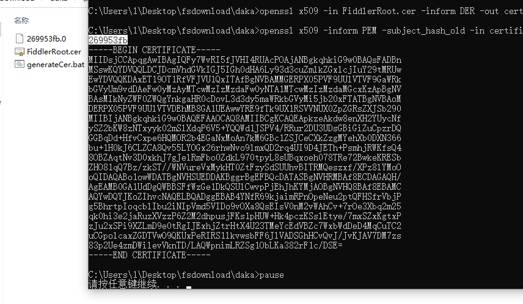
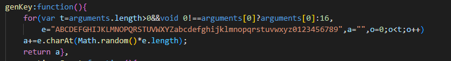
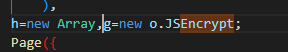
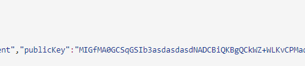
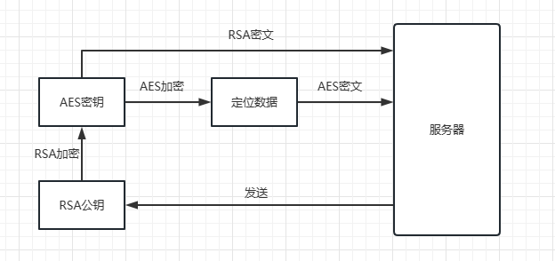
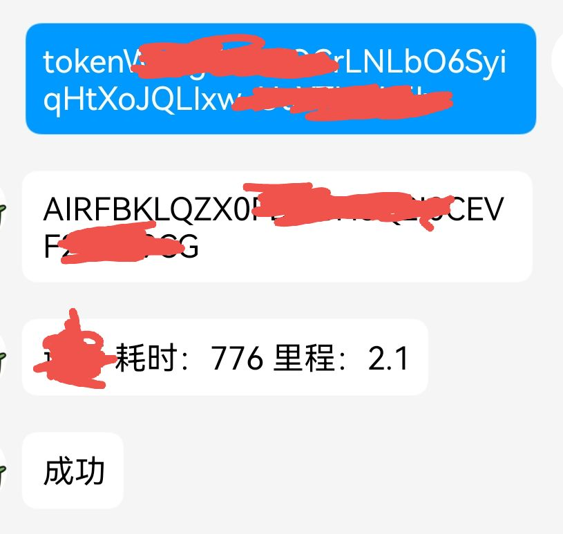

# FakeRunInFakeUniversity

某大专智障体育自动化打卡思路分享

    本分享包含的内容有：网络抓包、小程序逆向、微信逆向。

## 一、抓包

### 1、使用fiddler+移动端微信抓包

fiddler的基本使用请参考 [fiddler入门](https://zhuanlan.zhihu.com/p/410150022)。
没有经验请自行搜索 [fiddler抓包手机](https://www.bing.com/search?q=fiddler%E6%8A%93%E5%8C%85%E6%89%8B%E6%9C%BA&qs=n&form=QBRE&sp=-1&lq=0&pq=fiddler%E6%8A%93%E5%8C%85%E6%89%8B%E6%9C%BA&sc=10-11&sk=&cvid=5960BB3CE07349CEA21F08A998BFF7B3&ghsh=0&ghacc=0&ghpl=).
安卓7以后想要使用fiddler抓到https的包需要将fiddler的证书添加到系统证书。这里可以使用雷电模拟器省去root的麻烦,没有经验可以参考 [fiddler抓包雷电模拟器](https://zhuanlan.zhihu.com/p/551547587)。

导出fiddler的证书文件,cmd中运行命令将证书转换为pem文件：

```shell
openssl x509 -in FiddlerRoot.cer -inform DER -out certificate.pem -outform PEM
```
计算pem证书哈希：
```shell
openssl x509 -inform PEM -subject_hash_old -in certificate.pem
```
将 **pem证书** 重命名为 **{哈希值}.0** :




然后将该.0文件移动到安卓机 **/system/etc/security/cacerts/** 目录下，之后设置好安卓机的代理，就可以愉快的抓包了。


### 2、小程序通信过程分析

#### （1）检查绑定
```http
GET https://sport.cqupt.edu.cn/wxapp/wxUnifyId/checkBinding?wxCode=031xAh0wasdsdasdasd3QDsZX2xAh0j HTTP/1.1
Host: sport.cqupt.edu.cn
Connection: keep-alive
charset: utf-8
User-Agent: Mozilla/5.0 (Linux; Android 10; MI 8 Lite Build/QKQ1.190910.002; wv) AppleWebKit/537.36 (KHTML, like Gecko) Version/4.0 Chrome/107.0.5304.141 Mobile Safari/537.36 XWEB/5017 MMWEBSDK/20230202 MMWEBID/9800 MicroMessenger/8.0.33.2320(0x28002151) WeChat/arm64 Weixin NetType/WIFI Language/zh_CN ABI/arm64 MiniProgramEnv/android
content-type: application/json
Accept-Encoding: gzip,compress,br,deflate
Referer: https://servicewechat.com/wx1680cca9a19ee3c8/16/page-frame.html
```

GET请求传参wxcode，这个wxcode是小程序调用微信提供的接口wx.login()获取，是作为微信用户登录的一个临时凭证，五分钟的有效期，只能使用一次，并且wx.login()调用时使用的是微信自己的通信协议，所以正常抓包抓不到。返回的结果也只有绑定成功和绑定失败，用于确定当前账号是否已经绑定过学生。

#### （2）绑定学生
```http
GET https://sport.cqupt.edu.cn/wxapp/wxUnifyId/wecatBindUnifyId?unifyId=167xxxx&studentNo=2029xxxxxx&wxCode=021tQn1w3G8Qk03T031w3UJtpi3tQn12 HTTP/1.1
Host: sport.cqupt.edu.cn
Connection: keep-alive
charset: utf-8
User-Agent: Mozilla/5.0 (Linux; Android 10; MI 8 Lite Build/QKQ1.190910.002; wv) AppleWebKit/537.36 (KHTML, like Gecko) Version/4.0 Chrome/107.0.5304.141 Mobile Safari/537.36 XWEB/5017 MMWEBSDK/20230202 MMWEBID/9800 MicroMessenger/8.0.33.2320(0x28002151) WeChat/arm64 Weixin NetType/WIFI Language/zh_CN ABI/arm64 MiniProgramEnv/android
content-type: application/json
Accept-Encoding: gzip,compress,br,deflate
token: [object Undefined]
Referer: https://servicewechat.com/wx1680cca9a19ee3c8/16/page-frame.html

HTTP/1.1 200 OK
Server: rums/b
Date: Mon, 20 Mar 2023 11:28:03 GMT
Content-Type: application/json
Transfer-Encoding: chunked
Connection: keep-alive
Vary: Origin
Vary: Access-Control-Request-Method
Vary: Access-Control-Request-Headers
79
{"msg":"请求成功","code":"10200","data":{"msg":"绑定成功","token":"yrngxCDuNMxBasdasdasdasd7NgmXWNivEanO5vM"}}
0
```

GET请求传参统一认证吗、学号和wxcode，学号和认证号标识学生，wxcode标识微信用户，通过后会返回一个token作为小程序使用的一个临时凭证。有效期比wxcode长得多，换绑或者长时间没有和学校服务器通信都会失效。

#### （3）开始打卡

```http
POST https://sport.cqupt.edu.cn/wxapp/sportRecord/sport/start HTTP/1.1
Host: sport.cqupt.edu.cn
Connection: keep-alive
Content-Length: 161
charset: utf-8
User-Agent: Mozilla/5.0 (Linux; Android 10; MI 8 Lite Build/QKQ1.190910.002; wv) AppleWebKit/537.36 (KHTML, like Gecko) Version/4.0 Chrome/107.0.5304.141 Mobile Safari/537.36 XWEB/5017 MMWEBSDK/20230202 MMWEBID/9800 MicroMessenger/8.0.33.2320(0x28002151) WeChat/arm64 Weixin NetType/WIFI Language/zh_CN ABI/arm64 MiniProgramEnv/android
content-type: application/json
Accept-Encoding: gzip,compress,br,deflate
token: 1_sr3fCDsadasdasdasdasd_jl5DaWuOkvc3SV4
Referer: https://servicewechat.com/wx1680cca9a19ee3c8/16/page-frame.html

{"longitude":106.61017768012152,"latitude":29.532591417100694,"placeName":"太极运动场","placeCode":"T1005","collectTime":"2023-3-20 10:58:58","isValid":"1"}

HTTP/1.1 200 OK
Server: rums/b
Date: Mon, 20 Mar 2023 02:59:03 GMT
Content-Type: application/json
Transfer-Encoding: chunked
Connection: keep-alive
Vary: Origin
Vary: Access-Control-Request-Method
Vary: Access-Control-Request-Headers
2c7
{"msg":"请求成功","code":"10200","data":{"id":21312,"sportRecordNo":"RBL054sdfsdfOD8AMO4J94YSdfsdfKQJZ","unifyId":"167xxxx","studentName":"李二狗","studentNo":"2029xxxxxx","sex":"6","deptName":"意大利面与42号混凝土学院","deptCode":"30800","openid":"sfdfsdfsdfsdfdsfasdask","placeName":"太极运动场","placeCode":"T1005","mileage":0,"timeConsuming":0,"startTime":"2023-03-20 10:58:44","endTime":null,"isValid":null,"reason":null,"createBy":"167xxxx","createName":"李二狗","createTime":"2023-03-20T10:58:44.248+08:00","updateBy":"167xxxx","updateName":"李二狗","updateTime":"2023-03-20T10:58:44.248+08:00","remark":null,"sportDateStr":null,"sportHourStr":null,"reasonLabel":null}}
0
```
POST请求，传参如上，header里需要带有token做为认证信息。返回内容中：**sportRecordNo** 将会作为后台数据记录和计算的一个标识id。

#### （4）上传数据

```http
POST https://sport.cqupt.edu.cn/wxapp/sportRecord/point/saveList HTTP/1.1
Host: sport.cqupt.edu.cn
Connection: keep-alive
Content-Length: 1279
charset: utf-8
User-Agent: Mozilla/5.0 (Linux; Android 10; MI 8 Lite Build/QKQ1.190910.002; wv) AppleWebKit/537.36 (KHTML, like Gecko) Version/4.0 Chrome/107.0.5304.141 Mobile Safari/537.36 XWEB/5017 MMWEBSDK/20230202 MMWEBID/9800 MicroMessenger/8.0.33.2320(0x28002151) WeChat/arm64 Weixin NetType/WIFI Language/zh_CN ABI/arm64 MiniProgramEnv/android
content-type: application/json
Accept-Encoding: gzip,compress,br,deflate
token: 1_sr3fCDy8qLsdfsdfsdfsdfdfs_jl5DaWuOkvc3SV4
Referer: https://servicewechat.com/wx1680cca9a19ee3c8/16/page-frame.html

[{"sportRecordNo":"RBL039asdasdNOD8Aasdasda4YSEasadsdasd","longitude":106.60938503689236,"latitude":29.533369411892362,"placeName":"太极运动场","placeCode":"T1005","collectTime":"2023-3-20 11:14:22","isValid":"1"},{"sportRecordNo":"RBL039asdasdNOD8Aasdasda4YSEasadsdasd","longitude":106.60938503689236,"latitude":29.533369411892362,"placeName":"太极运动场","placeCode":"T1005","collectTime":"2023-3-20 11:14:23","isValid":"1"},{"sportRecordNo":"RBL039asdasdNOD8Aasdasda4YSEasadsdasd","longitude":106.60938503689236,"latitude":29.533369411892362,"placeName":"太极运动场","placeCode":"T1005","collectTime":"2023-3-20 11:14:23","isValid":"1"},{"sportRecordNo":"RBL039asdasdNOD8Aasdasda4YSEasadsdasd","longitude":106.60938503689236,"latitude":29.533369411892362,"placeName":"太极运动场","placeCode":"T1005","collectTime":"2023-3-20 11:14:24","isValid":"1"},{"sportRecordNo":"RBL039asdasdNOD8Aasdasda4YSEasadsdasd","longitude":106.60938503689236,"latitude":29.533369411892362,"placeName":"太极运动场","placeCode":"T1005","collectTime":"2023-3-20 11:14:24","isValid":"1"},{"sportRecordNo":"RBL039asdasdNOD8Aasdasda4YSEasadsdasd","longitude":106.60938503689236,"latitude":29.533369411892362,"placeName":"太极运动场","placeCode":"T1005","collectTime":"2023-3-20 11:14:25","isValid":"1"}]

HTTP/1.1 200 OK
Server: rums/b
Date: Mon, 20 Mar 2023 03:14:30 GMT
Content-Type: application/json
Transfer-Encoding: chunked
Connection: keep-alive
Vary: Origin
Vary: Access-Control-Request-Method
Vary: Access-Control-Request-Headers
d2
{"msg":"请求成功","code":"10200","data":{"sportRecordNo":"RBL039asdasdNOD8Aasdasda4YSEasadsdasd","unifyId":"1670503","studentName":"李二狗","mileage":2.01,"timeConsuming":985,"expiredCountInForbiddenArea":0}}
0
```
POST请求，传参一个列表包含五次收集的位置与时间，sportRecordNo参数用来标识这一次跑步数据，需要和开始打卡时获取的一致。header里带token标识身份，返回的数据中包含了当前跑步的里程和耗时。
需要注意的时在 2023/04/01 前saveList请求的数据还是通过明文传输，之后学校便对这部分数据进行了加密，加密方面会在后面的小程序逆向细说。

更改后的请求如下：
```http
POST /wxapp/sportRecord/point/saveList?data=jYo6md14mqVKAifUFJJDCXOLQqfYXEGGVtdcwJtsmcRBI3pIFkFfJHNVvdVrF2gaRgvaz9hz21gMaM1fRRDNT74mcNytCnX7P4PtSNMguBh+6J5OGQ72cmBhn/LO4fyhup+dvnlaVNLFYhZIgEaeHiKSSPB5aBDc5XDoSG/9gldin0do/8or7/guATC+QIFV1dLLbJUNMa1/zmZV3Qw6Jrzwf0Tl28a2Why6Hr1330ETVKetpmATycGzvEhYo+avx5zgCjh2k9HfZf+hsPeVg8nvoHy8NwBYXnHJwZmgWSC+jFZALdOb24bwXOa++qeOISJBOtGfXfgiBJ4f4xlHi2hsdSXn/CXQC2/kD3iYTwfaumbELnI+D2V5OQyypv/DqTp6YskRi2DvY9Gcfv7PAmeSjMcWEEKu2miRRPk6bnqvxsBQeitC5w49OK0zdqnvAFy/Il9aKJCdeLycxIkjVKySy+qdyDsll/Jb8XI/1SfiYdgMrg3lkXX2P2TSG3f7Ximol1LSA6qsSufsZZrNDcffd13F8Yu0HTk/VaRLqbkbggLVdEGkCa8m3P3wMsCYuJDp9epjCvC1XyYFoCJ1KX2uoa7olOx1bs8hjowaIQy0W+CCbEdn01UCepWl7LlfwbtB7NLIc5fLbMTgo27HgAczYsQvn+dxRAbn/lVqVPxmrIIgih8cKisRMFD2aywfdqpGGeEP8McoyePlr0HA/V7t/jay5DO8YzdnL2EkpfJOaFOYkWzORHQr2GVG+nUVIJlej92ilpPNoSG4FRk6MlByuDgbLhrOuOQkSuj2CfwDMRsTu+RB2TaO3fbRbr3ZWrYTnelC8YnQuyApYqOqhu63bQJv7Y7wtEITfiFomtO+OpxFAvR1s3vaWmX0DeGjuHuYXpV5PmX5Rv/CqiB1vzdLvUFcU9p+7xnbO9Gyx07Zz4HSbMOrFtPzdpg2SXJmTNPXTA3PWcqOYQidS17B0SW7y/p5AEvzFFR8aod6z9mtiWmv9lhhooaI16MlgHc6KpVczolLcpr9AyiCSZJ+mvYmo8Iw1+szPL6+EXTChpkdw3AVhF0PEDCAPh70pmMlatf+G/NmtFtsheuQ+ikx307vOGeGtkTC1SolhbXYYMIx04fH4Hx/gmAsLtDkhIVmfQPtosbuaX3X0B0EkCEh9kEjekgWQV8kc1W91WsXaBpGC9rP2HPbWAxozV9FEM1PviZw3K0Kdfs/g+1I0yC4GB0ipR4CWAUodbtNdvM1zs/Tx7hurh7zgjwtbz4oYy820r+OTtwV0390w8OOQqHvUm3vpAkdnfGcMXKJVCM8MB/V0stslQ0xrX/OZlXdDDomvPB/ROXbxrZaHLoevXffQRNUp62mYBPJwbO8SFij5q/HnOAKOHaT0d9l/6Gw95WD+Js1p7zGv+2seMFq2LGdCb37GdZUvN97S/y8JYVKO1c=&aesKey=OsbJTCvQkD0fykjod75FGwmrGoI2urOeto37x86jc+TJS3tYHlrVdtkYAJp/Kkn2GCe8hiXjPTRc2bhUIQoAqHMegd8xboq04b80uC+z+b6KoQ8eRj8T1zgR6XnRr3JbJthdRzFh8RJWtd/HSHsBrrrDpPifFY5zGiqGIrMCZrw= HTTP/1.1
Host: sport.cqupt.edu.cn
Connection: keep-alive
Content-Length: 200
charset: utf-8
User-Agent: Mozilla/5.0 (Linux; Android 10; MI 8 Lite Build/QKQ1.190910.002; wv) AppleWebKit/537.36 (KHTML, like Gecko) Version/4.0 Chrome/107.0.5304.141 Mobile Safari/537.36 XWEB/5023 MMWEBSDK/20230202 MMWEBID/4258 MicroMessenger/8.0.33.2320(0x28002151) WeChat/arm64 Weixin NetType/WIFI Language/zh_CN ABI/arm64 MiniProgramEnv/android
content-type: application/json
Accept-Encoding: gzip,compress,br,deflate
token: 5QFm-gwuRfdsdfsdfsdfsdf9Clf1mPr8
Referer: https://servicewechat.com/wx1680cca9a19ee3c8/19/page-frame.html

{"data":"dsdsd","aesKey":"OsbJTCvQkD0fykjod75FGwmrGoI2urOeto37x86jc+TJS3tYHlrVdtkYAJp/Kkn2GCe8hiXjPTRc2bhUIQoAqHMegd8xboq04b80uC+z+b6KoQ8eRj8T1zgR6XnRr3JbJthdRzFh8RJWtd/HSHsBrrrDpPifFY5zGiqGIrMCZrw="}
```

#### （5）获取用户信息
```http
GET https://sport.cqupt.edu.cn/wxapp/wxUnifyId/getUser HTTP/1.1
Host: sport.cqupt.edu.cn
Connection: keep-alive
charset: utf-8
User-Agent: Mozilla/5.0 (Linux; Android 9; PCLM10 Build/PQ3B.190801.002; wv) AppleWebKit/537.36 (KHTML, like Gecko) Version/4.0 Chrome/91.0.4472.114 Safari/537.36 MMWEBID/9800 MicroMessenger/8.0.2.1860(0x28000234) Process/appbrand0 WeChat/arm32 Weixin Android Tablet NetType/WIFI Language/zh_CN ABI/arm64 MiniProgramEnv/android
content-type: application/json
Accept-Encoding: gzip,compress,br,deflate
token: hfU6asdadsasduDZjBz24gaHWsadasdasdasd4CHI
Referer: https://servicewechat.com/wx1680cca9a19ee3c8/20/page-frame.html

HTTP/1.1 200 OK
Server: rums/b
Date: Fri, 21 Apr 2023 01:32:16 GMT
Content-Type: application/json
Transfer-Encoding: chunked
Connection: keep-alive
Vary: Origin
Vary: Access-Control-Request-Method
Vary: Access-Control-Request-Headers

1df
{"msg":"请求成功","code":"10200","data":{"id":15009,"avatar":null,"username":"李二狗","unifyId":"169xxxx","studentNo":"2029xxxxxx","sex":"6","grade":"2029","major":null,"deptName":"意大利面与42号混凝土学院","roleCode":"student","publicKey":"MIGfMA0GCSqGSIb3asdasdasdNADCBiQKBgQCkWZ+WLKvCPMaqx1B0/lzKHZQeMudeHf83n2MJjjdO+lqHr3xhQvnBYnQSizNdho3Gj9hxkfuIGhxX83VHmpfYPZHOb37KKZY8QwXAUg63NzJgyl4634me9YGXPNW7oKgAc/J6X8FphHgnFuVnTza0ce5Vq6vbKgcH1pP2cVgqbwIDAQAB"}}
0
```
GET请求，header里带token，用于获取学生的一些个人信息，本来这个接口与我们的目标无关，但四月后，他返回的信息里包含了一个公钥，用于加密saveList接口中要上传的数据。

#### （6）结束打卡
```http
POST https://sport.cqupt.edu.cn/wxapp/sportRecord/sport/endList HTTP/1.1
Host: sport.cqupt.edu.cn
Connection: keep-alive
Content-Length: 878
charset: utf-8
User-Agent: Mozilla/5.0 (Linux; Android 10; MI 8 Lite Build/QKQ1.190910.002; wv) AppleWebKit/537.36 (KHTML, like Gecko) Version/4.0 Chrome/107.0.5304.141 Mobile Safari/537.36 XWEB/5017 MMWEBSDK/20230202 MMWEBID/9800 MicroMessenger/8.0.33.2320(0x28002151) WeChat/arm64 Weixin NetType/WIFI Language/zh_CN ABI/arm64 MiniProgramEnv/android
content-type: application/json
Accept-Encoding: gzip,compress,br,deflate
token: 1_sr3fCasdasdasdasdsaddaasdasl5DaWuOkvc3SV4
Referer: https://servicewechat.com/wx1680cca9a19ee3c8/16/page-frame.html

{"sportPointRequests":[[{"sportRecordNo":"asdasdasdasdAMO4J94YSEasdasdasda","longitude":106.60938503689236,"latitude":29.533369411892362,"placeName":"太极运动场","placeCode":"T1005","collectTime":"2023-3-20 11:14:39","isValid":"1"},{"sportRecordNo":"asdasdasdasdAMO4J94YSEasdasdasda","longitude":106.60938503689236,"latitude":29.533369411892362,"placeName":"太极运动场","placeCode":"T1005","collectTime":"2023-3-20 11:14:40","isValid":"1"},{"sportRecordNo":"asdasdasdasdAMO4J94YSEasdasdasda","longitude":106.60938503689236,"latitude":29.533369411892362,"placeName":"太极运动场","placeCode":"T1005","collectTime":"2023-3-20 11:14:41","isValid":"1"},{"sportRecordNo":"asdasdasdasdAMO4J94YSEasdasdasda","longitude":106.60938503689236,"latitude":29.533369411892362,"placeName":"太极运动场","placeCode":"T1005","collectTime":"2023-3-20 11:14:41","isValid":"1"}]]}

HTTP/1.1 200 OK
Server: rums/b
Date: Mon, 20 Mar 2023 03:14:47 GMT
Content-Type: application/json
Transfer-Encoding: chunked
Connection: keep-alive
Vary: Origin
Vary: Access-Control-Request-Method
Vary: Access-Control-Request-Headers
d2
{"msg":"请求成功","code":"10200","data":{"sportRecordNo":"asdasdasdasdAMO4J94YSEasdasdasda","unifyId":"1670503","studentName":"李二狗","mileage":2.01,"timeConsuming":999,"expiredCountInForbiddenArea":0}}
0
```
POST请求，传参一到五个定位点，header里带token，作为本次跑步的结束标志，返回结果里包含最终的里程数和耗时。

#### （7）解除绑定
```http
PUT https://sport.cqupt.edu.cn/wxapp/wxUnifyId/binding/unlock HTTP/1.1
Host: sport.cqupt.edu.cn
Connection: keep-alive
Content-Length: 90
charset: utf-8
User-Agent: Mozilla/5.0 (Linux; Android 10; MI 8 Lite Build/QKQ1.190910.002; wv) AppleWebKit/537.36 (KHTML, like Gecko) Version/4.0 Chrome/107.0.5304.141 Mobile Safari/537.36 XWEB/5017 MMWEBSDK/20230202 MMWEBID/9800 MicroMessenger/8.0.33.2320(0x28002151) WeChat/arm64 Weixin NetType/WIFI Language/zh_CN ABI/arm64 MiniProgramEnv/android
content-type: application/json
Accept-Encoding: gzip,compress,br,deflate
token: yhTvPosadasdasdasdasdas7iZ6h26ANeqY
Referer: https://servicewechat.com/wx1680cca9a19ee3c8/16/page-frame.html

{"wxCode":"041OasdasdasdasdasdasdasdOU0OIn1e","studentNo":"2029xxxxxx","unifyId":"169xxxx"}
```

少见的PUT请求，传参wxcode，认证码和学号，header带token，返回也很简单就是解绑成功或者失败。

## 二、小程序逆向，获取加密方式

### 1、起因
按之前的抓包分析我们知道，小程序在请求saveList接口时，所上传的数据是经过加密的。我们上传时也需要把数据进行相同的处理，而具体的加密过程则可以在小程序内找到。

### 2、工具

这里使用了开源工具 [wxappUnpacker](https://github.com/aen516954023/wxappUnpacker) 请参照连接内说明进行安装。

安卓机内的小程序安装位置应该是位于：**/data/data/com.tencent.mm/MicroMsg/{一串id}/appbrand/{id}.wxapkg**

实在找不到可以直接搜索 **wxapkg** 根据时间确定学校的小程序。

### 3、分析
工具解包后的代码虽然是被压缩和混淆过的，但很多实例的方法名还是正常的，可读性还是很好的。

因为被加密的请求只有saveList，所以我们可以尝试在各个文件中搜索这个字符串，看看能不能找到小程序在发送请求前进行了那些操作。

随后我们便在 **app-service.js** 文件中找到了疑似代码。格式化后分析前后代码：


可以看到一个实例调用了 **getMapDistance** 方法，随后又把一些经纬度，还有时间等信息压入到了一个队列i。所以这里应该是在收集定位信息准备上传。

随后调用了 **genkey** 方法，所以v应该是生成的某种密钥，随后便对密钥v进行了某种加密。

v又被作为密钥对收集的定位信息i进行了AES加密，模式为ECB，没偏移。

随后他在链接中把被加密后的定位信息和加密后的AES密钥作为参数传入，又在body中上传了一次加密AES密钥，一个东西传两次，这部操作挺迷的。

跟踪一下 **genkey()** 搜索下函数名就可以在上面找到:

内容不复杂也不常见，实际功能实际生成一个长度16的字母数字组成的字符串，用来做AES密钥。

再找一下 **encrypt()** 的功能，直接搜字符串结果有点多不好分析，这是个是g的方法，我们可以找找是谁实例化的g。




再往上走可以看到g是个 **JSEncrypt** 实例，网上搜一下可以知道，jsencrypt是前端用来进行RSA加密的一个库。

正好我们之前在分析getUserInfo接口时返回的数据包括一个公钥。

这个公钥应该就是RSA的公钥。

### 4、结论


学校的小程序并不是自己构建的这些加密算法，而是直接使用的公开库，所以我们也可以用这些库很方便得完成相同的加密过程。


## 三、向自动化迈进

### 1、先尝试实现半自动
到目前为止除了wxcode我们尚无法获取外，其他小程序与服务器通信的过程我们完全可以自己在本地实现。

相对于与wxcode，服务器返回的token则是个时效更长，获取更容易的认证票据，具体思路为：
（1）打卡前绑定小程序
（2）**抓包** 获取token
（3）以该token为票据依次请求 **start** 、 **saveList** 和 **endList** 接口，完成一次有效的打卡数据上传。
（4）解绑小程序（可选）。

实现效果如图：


这样打卡终究还是很麻烦，每次打卡前都需要抓包，移动端root过的手机一般来说不好找。也可以在出发前在电脑端抓到自己的token，然后再去打卡，一个token的有效期是足够的。

无论哪种方法都是极不方便的，我们追求的是一种可以自动化的打卡体验，这就需要我们想办法去获取wxcode。

### 自动化实现思路一：从小程序获取wxcode

### 自动化实现思路二：从微信获取wxcode

#TO BE CONTINUE...