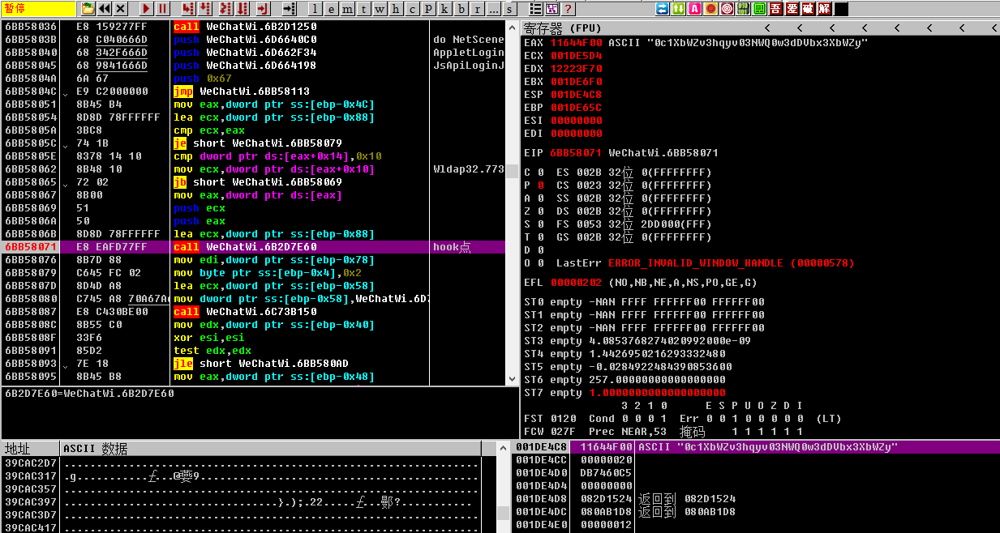
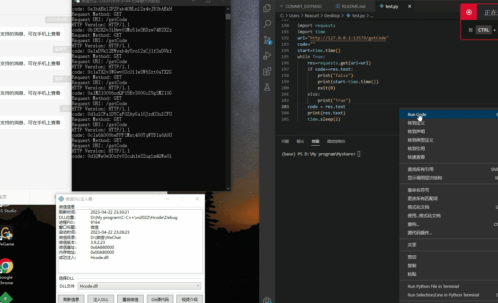

# FakeRunInFakeUniversity

某大专智障体育自动化打卡思路分享

    本分享包含的内容有：网络抓包、小程序逆向、微信逆向。

## 一、抓包

### 1、使用fiddler+移动端微信抓包

fiddler的基本使用请参考 [fiddler入门](https://zhuanlan.zhihu.com/p/410150022)。
没有经验请自行搜索 [fiddler抓包手机](https://www.bing.com/search?q=fiddler%E6%8A%93%E5%8C%85%E6%89%8B%E6%9C%BA&qs=n&form=QBRE&sp=-1&lq=0&pq=fiddler%E6%8A%93%E5%8C%85%E6%89%8B%E6%9C%BA&sc=10-11&sk=&cvid=5960BB3CE07349CEA21F08A998BFF7B3&ghsh=0&ghacc=0&ghpl=).
安卓7以后想要使用fiddler抓到https的包需要将fiddler的证书添加到系统证书。这里可以使用雷电模拟器省去root的麻烦,没有经验可以参考 [fiddler抓包雷电模拟器](https://zhuanlan.zhihu.com/p/551547587)。

导出fiddler的证书文件,cmd中运行命令将证书转换为pem文件：

```shell
openssl x509 -in FiddlerRoot.cer -inform DER -out certificate.pem -outform PEM
```
计算pem证书哈希：
```shell
openssl x509 -inform PEM -subject_hash_old -in certificate.pem
```
将 **pem证书** 重命名为 **{哈希值}.0** :


然后将该.0文件移动到安卓机 **/system/etc/security/cacerts/** 目录下，之后设置好安卓机的代理，就可以愉快的抓包了。


### 2、小程序通信过程分析

#### （1）检查绑定
```http
GET https://sport.cqupt.edu.cn/wxapp/wxUnifyId/checkBinding?wxCode=031xAh0wasdsdasdasd3QDsZX2xAh0j HTTP/1.1
Host: sport.cqupt.edu.cn
Connection: keep-alive
charset: utf-8
User-Agent: Mozilla/5.0 (Linux; Android 10; MI 8 Lite Build/QKQ1.190910.002; wv) AppleWebKit/537.36 (KHTML, like Gecko) Version/4.0 Chrome/107.0.5304.141 Mobile Safari/537.36 XWEB/5017 MMWEBSDK/20230202 MMWEBID/9800 MicroMessenger/8.0.33.2320(0x28002151) WeChat/arm64 Weixin NetType/WIFI Language/zh_CN ABI/arm64 MiniProgramEnv/android
content-type: application/json
Accept-Encoding: gzip,compress,br,deflate
Referer: https://servicewechat.com/wx1680cca9a19ee3c8/16/page-frame.html
```

GET请求传参wxcode，这个wxcode是小程序调用微信提供的接口wx.login()获取，是作为微信用户登录的一个临时凭证，五分钟的有效期，只能使用一次，并且wx.login()调用时使用的是微信自己的通信协议，所以正常抓包抓不到。返回的结果也只有绑定成功和绑定失败，用于确定当前账号是否已经绑定过学生。

#### （2）绑定学生
```http
GET https://sport.cqupt.edu.cn/wxapp/wxUnifyId/wecatBindUnifyId?unifyId=167xxxx&studentNo=2029xxxxxx&wxCode=021tQn1w3G8Qk03T031w3UJtpi3tQn12 HTTP/1.1
Host: sport.cqupt.edu.cn
Connection: keep-alive
charset: utf-8
User-Agent: Mozilla/5.0 (Linux; Android 10; MI 8 Lite Build/QKQ1.190910.002; wv) AppleWebKit/537.36 (KHTML, like Gecko) Version/4.0 Chrome/107.0.5304.141 Mobile Safari/537.36 XWEB/5017 MMWEBSDK/20230202 MMWEBID/9800 MicroMessenger/8.0.33.2320(0x28002151) WeChat/arm64 Weixin NetType/WIFI Language/zh_CN ABI/arm64 MiniProgramEnv/android
content-type: application/json
Accept-Encoding: gzip,compress,br,deflate
token: [object Undefined]
Referer: https://servicewechat.com/wx1680cca9a19ee3c8/16/page-frame.html

HTTP/1.1 200 OK
Server: rums/b
Date: Mon, 20 Mar 2023 11:28:03 GMT
Content-Type: application/json
Transfer-Encoding: chunked
Connection: keep-alive
Vary: Origin
Vary: Access-Control-Request-Method
Vary: Access-Control-Request-Headers
79
{"msg":"请求成功","code":"10200","data":{"msg":"绑定成功","token":"yrngxCDuNMxBasdasdasdasd7NgmXWNivEanO5vM"}}
0
```

GET请求传参统一认证吗、学号和wxcode，学号和认证号标识学生，wxcode标识微信用户，通过后会返回一个token作为小程序使用的一个临时凭证。有效期比wxcode长得多，换绑或者长时间没有和学校服务器通信都会失效。

#### （3）开始打卡

```http
POST https://sport.cqupt.edu.cn/wxapp/sportRecord/sport/start HTTP/1.1
Host: sport.cqupt.edu.cn
Connection: keep-alive
Content-Length: 161
charset: utf-8
User-Agent: Mozilla/5.0 (Linux; Android 10; MI 8 Lite Build/QKQ1.190910.002; wv) AppleWebKit/537.36 (KHTML, like Gecko) Version/4.0 Chrome/107.0.5304.141 Mobile Safari/537.36 XWEB/5017 MMWEBSDK/20230202 MMWEBID/9800 MicroMessenger/8.0.33.2320(0x28002151) WeChat/arm64 Weixin NetType/WIFI Language/zh_CN ABI/arm64 MiniProgramEnv/android
content-type: application/json
Accept-Encoding: gzip,compress,br,deflate
token: 1_sr3fCDsadasdasdasdasd_jl5DaWuOkvc3SV4
Referer: https://servicewechat.com/wx1680cca9a19ee3c8/16/page-frame.html

{"longitude":106.61017768012152,"latitude":29.532591417100694,"placeName":"太极运动场","placeCode":"T1005","collectTime":"2023-3-20 10:58:58","isValid":"1"}

HTTP/1.1 200 OK
Server: rums/b
Date: Mon, 20 Mar 2023 02:59:03 GMT
Content-Type: application/json
Transfer-Encoding: chunked
Connection: keep-alive
Vary: Origin
Vary: Access-Control-Request-Method
Vary: Access-Control-Request-Headers
2c7
{"msg":"请求成功","code":"10200","data":{"id":21312,"sportRecordNo":"RBL054sdfsdfOD8AMO4J94YSdfsdfKQJZ","unifyId":"167xxxx","studentName":"李二狗","studentNo":"2029xxxxxx","sex":"6","deptName":"意大利面与42号混凝土学院","deptCode":"30800","openid":"sfdfsdfsdfsdfdsfasdask","placeName":"太极运动场","placeCode":"T1005","mileage":0,"timeConsuming":0,"startTime":"2023-03-20 10:58:44","endTime":null,"isValid":null,"reason":null,"createBy":"167xxxx","createName":"李二狗","createTime":"2023-03-20T10:58:44.248+08:00","updateBy":"167xxxx","updateName":"李二狗","updateTime":"2023-03-20T10:58:44.248+08:00","remark":null,"sportDateStr":null,"sportHourStr":null,"reasonLabel":null}}
0
```
POST请求，传参如上，header里需要带有token做为认证信息。返回内容中：**sportRecordNo** 将会作为后台数据记录和计算的一个标识id。

#### （4）上传数据

```http
POST https://sport.cqupt.edu.cn/wxapp/sportRecord/point/saveList HTTP/1.1
Host: sport.cqupt.edu.cn
Connection: keep-alive
Content-Length: 1279
charset: utf-8
User-Agent: Mozilla/5.0 (Linux; Android 10; MI 8 Lite Build/QKQ1.190910.002; wv) AppleWebKit/537.36 (KHTML, like Gecko) Version/4.0 Chrome/107.0.5304.141 Mobile Safari/537.36 XWEB/5017 MMWEBSDK/20230202 MMWEBID/9800 MicroMessenger/8.0.33.2320(0x28002151) WeChat/arm64 Weixin NetType/WIFI Language/zh_CN ABI/arm64 MiniProgramEnv/android
content-type: application/json
Accept-Encoding: gzip,compress,br,deflate
token: 1_sr3fCDy8qLsdfsdfsdfsdfdfs_jl5DaWuOkvc3SV4
Referer: https://servicewechat.com/wx1680cca9a19ee3c8/16/page-frame.html

[{"sportRecordNo":"RBL039asdasdNOD8Aasdasda4YSEasadsdasd","longitude":106.60938503689236,"latitude":29.533369411892362,"placeName":"太极运动场","placeCode":"T1005","collectTime":"2023-3-20 11:14:22","isValid":"1"},{"sportRecordNo":"RBL039asdasdNOD8Aasdasda4YSEasadsdasd","longitude":106.60938503689236,"latitude":29.533369411892362,"placeName":"太极运动场","placeCode":"T1005","collectTime":"2023-3-20 11:14:23","isValid":"1"},{"sportRecordNo":"RBL039asdasdNOD8Aasdasda4YSEasadsdasd","longitude":106.60938503689236,"latitude":29.533369411892362,"placeName":"太极运动场","placeCode":"T1005","collectTime":"2023-3-20 11:14:23","isValid":"1"},{"sportRecordNo":"RBL039asdasdNOD8Aasdasda4YSEasadsdasd","longitude":106.60938503689236,"latitude":29.533369411892362,"placeName":"太极运动场","placeCode":"T1005","collectTime":"2023-3-20 11:14:24","isValid":"1"},{"sportRecordNo":"RBL039asdasdNOD8Aasdasda4YSEasadsdasd","longitude":106.60938503689236,"latitude":29.533369411892362,"placeName":"太极运动场","placeCode":"T1005","collectTime":"2023-3-20 11:14:24","isValid":"1"},{"sportRecordNo":"RBL039asdasdNOD8Aasdasda4YSEasadsdasd","longitude":106.60938503689236,"latitude":29.533369411892362,"placeName":"太极运动场","placeCode":"T1005","collectTime":"2023-3-20 11:14:25","isValid":"1"}]

HTTP/1.1 200 OK
Server: rums/b
Date: Mon, 20 Mar 2023 03:14:30 GMT
Content-Type: application/json
Transfer-Encoding: chunked
Connection: keep-alive
Vary: Origin
Vary: Access-Control-Request-Method
Vary: Access-Control-Request-Headers
d2
{"msg":"请求成功","code":"10200","data":{"sportRecordNo":"RBL039asdasdNOD8Aasdasda4YSEasadsdasd","unifyId":"1670503","studentName":"李二狗","mileage":2.01,"timeConsuming":985,"expiredCountInForbiddenArea":0}}
0
```
POST请求，传参一个列表包含五次收集的位置与时间，sportRecordNo参数用来标识这一次跑步数据，需要和开始打卡时获取的一致。header里带token标识身份，返回的数据中包含了当前跑步的里程和耗时。
需要注意的时在 2023/04/01 前saveList请求的数据还是通过明文传输，之后学校便对这部分数据进行了加密，加密方面会在后面的小程序逆向细说。

更改后的请求如下：
```http
POST /wxapp/sportRecord/point/saveList?data=jYo6md14mqVKAifUFJJDCXOLQqfYXEGGVtdcwJtsmcRBI3pIFkFfJHNVvdVrF2gaRgvaz9hz21gMaM1fRRDNT74mcNytCnX7P4PtSNMguBh+6J5OGQ72cmBhn/LO4fyhup+dvnlaVNLFYhZIgEaeHiKSSPB5aBDc5XDoSG/9gldin0do/8or7/guATC+QIFV1dLLbJUNMa1/zmZV3Qw6Jrzwf0Tl28a2Why6Hr1330ETVKetpmATycGzvEhYo+avx5zgCjh2k9HfZf+hsPeVg8nvoHy8NwBYXnHJwZmgWSC+jFZALdOb24bwXOa++qeOISJBOtGfXfgiBJ4f4xlHi2hsdSXn/CXQC2/kD3iYTwfaumbELnI+D2V5OQyypv/DqTp6YskRi2DvY9Gcfv7PAmeSjMcWEEKu2miRRPk6bnqvxsBQeitC5w49OK0zdqnvAFy/Il9aKJCdeLycxIkjVKySy+qdyDsll/Jb8XI/1SfiYdgMrg3lkXX2P2TSG3f7Ximol1LSA6qsSufsZZrNDcffd13F8Yu0HTk/VaRLqbkbggLVdEGkCa8m3P3wMsCYuJDp9epjCvC1XyYFoCJ1KX2uoa7olOx1bs8hjowaIQy0W+CCbEdn01UCepWl7LlfwbtB7NLIc5fLbMTgo27HgAczYsQvn+dxRAbn/lVqVPxmrIIgih8cKisRMFD2aywfdqpGGeEP8McoyePlr0HA/V7t/jay5DO8YzdnL2EkpfJOaFOYkWzORHQr2GVG+nUVIJlej92ilpPNoSG4FRk6MlByuDgbLhrOuOQkSuj2CfwDMRsTu+RB2TaO3fbRbr3ZWrYTnelC8YnQuyApYqOqhu63bQJv7Y7wtEITfiFomtO+OpxFAvR1s3vaWmX0DeGjuHuYXpV5PmX5Rv/CqiB1vzdLvUFcU9p+7xnbO9Gyx07Zz4HSbMOrFtPzdpg2SXJmTNPXTA3PWcqOYQidS17B0SW7y/p5AEvzFFR8aod6z9mtiWmv9lhhooaI16MlgHc6KpVczolLcpr9AyiCSZJ+mvYmo8Iw1+szPL6+EXTChpkdw3AVhF0PEDCAPh70pmMlatf+G/NmtFtsheuQ+ikx307vOGeGtkTC1SolhbXYYMIx04fH4Hx/gmAsLtDkhIVmfQPtosbuaX3X0B0EkCEh9kEjekgWQV8kc1W91WsXaBpGC9rP2HPbWAxozV9FEM1PviZw3K0Kdfs/g+1I0yC4GB0ipR4CWAUodbtNdvM1zs/Tx7hurh7zgjwtbz4oYy820r+OTtwV0390w8OOQqHvUm3vpAkdnfGcMXKJVCM8MB/V0stslQ0xrX/OZlXdDDomvPB/ROXbxrZaHLoevXffQRNUp62mYBPJwbO8SFij5q/HnOAKOHaT0d9l/6Gw95WD+Js1p7zGv+2seMFq2LGdCb37GdZUvN97S/y8JYVKO1c=&aesKey=OsbJTCvQkD0fykjod75FGwmrGoI2urOeto37x86jc+TJS3tYHlrVdtkYAJp/Kkn2GCe8hiXjPTRc2bhUIQoAqHMegd8xboq04b80uC+z+b6KoQ8eRj8T1zgR6XnRr3JbJthdRzFh8RJWtd/HSHsBrrrDpPifFY5zGiqGIrMCZrw= HTTP/1.1
Host: sport.cqupt.edu.cn
Connection: keep-alive
Content-Length: 200
charset: utf-8
User-Agent: Mozilla/5.0 (Linux; Android 10; MI 8 Lite Build/QKQ1.190910.002; wv) AppleWebKit/537.36 (KHTML, like Gecko) Version/4.0 Chrome/107.0.5304.141 Mobile Safari/537.36 XWEB/5023 MMWEBSDK/20230202 MMWEBID/4258 MicroMessenger/8.0.33.2320(0x28002151) WeChat/arm64 Weixin NetType/WIFI Language/zh_CN ABI/arm64 MiniProgramEnv/android
content-type: application/json
Accept-Encoding: gzip,compress,br,deflate
token: 5QFm-gwuRfdsdfsdfsdfsdf9Clf1mPr8
Referer: https://servicewechat.com/wx1680cca9a19ee3c8/19/page-frame.html

{"data":"dsdsd","aesKey":"OsbJTCvQkD0fykjod75FGwmrGoI2urOeto37x86jc+TJS3tYHlrVdtkYAJp/Kkn2GCe8hiXjPTRc2bhUIQoAqHMegd8xboq04b80uC+z+b6KoQ8eRj8T1zgR6XnRr3JbJthdRzFh8RJWtd/HSHsBrrrDpPifFY5zGiqGIrMCZrw="}
```

#### （5）获取用户信息
```http
GET https://sport.cqupt.edu.cn/wxapp/wxUnifyId/getUser HTTP/1.1
Host: sport.cqupt.edu.cn
Connection: keep-alive
charset: utf-8
User-Agent: Mozilla/5.0 (Linux; Android 9; PCLM10 Build/PQ3B.190801.002; wv) AppleWebKit/537.36 (KHTML, like Gecko) Version/4.0 Chrome/91.0.4472.114 Safari/537.36 MMWEBID/9800 MicroMessenger/8.0.2.1860(0x28000234) Process/appbrand0 WeChat/arm32 Weixin Android Tablet NetType/WIFI Language/zh_CN ABI/arm64 MiniProgramEnv/android
content-type: application/json
Accept-Encoding: gzip,compress,br,deflate
token: hfU6asdadsasduDZjBz24gaHWsadasdasdasd4CHI
Referer: https://servicewechat.com/wx1680cca9a19ee3c8/20/page-frame.html

HTTP/1.1 200 OK
Server: rums/b
Date: Fri, 21 Apr 2023 01:32:16 GMT
Content-Type: application/json
Transfer-Encoding: chunked
Connection: keep-alive
Vary: Origin
Vary: Access-Control-Request-Method
Vary: Access-Control-Request-Headers

1df
{"msg":"请求成功","code":"10200","data":{"id":15009,"avatar":null,"username":"李二狗","unifyId":"169xxxx","studentNo":"2029xxxxxx","sex":"6","grade":"2029","major":null,"deptName":"意大利面与42号混凝土学院","roleCode":"student","publicKey":"MIGfMA0GCSqGSIb3asdasdasdNADCBiQKBgQCkWZ+WLKvCPMaqx1B0/lzKHZQeMudeHf83n2MJjjdO+lqHr3xhQvnBYnQSizNdho3Gj9hxkfuIGhxX83VHmpfYPZHOb37KKZY8QwXAUg63NzJgyl4634me9YGXPNW7oKgAc/J6X8FphHgnFuVnTza0ce5Vq6vbKgcH1pP2cVgqbwIDAQAB"}}
0
```
GET请求，header里带token，用于获取学生的一些个人信息，本来这个接口与我们的目标无关，但四月后，他返回的信息里包含了一个公钥，用于加密saveList接口中要上传的数据。

#### （6）结束打卡
```http
POST https://sport.cqupt.edu.cn/wxapp/sportRecord/sport/endList HTTP/1.1
Host: sport.cqupt.edu.cn
Connection: keep-alive
Content-Length: 878
charset: utf-8
User-Agent: Mozilla/5.0 (Linux; Android 10; MI 8 Lite Build/QKQ1.190910.002; wv) AppleWebKit/537.36 (KHTML, like Gecko) Version/4.0 Chrome/107.0.5304.141 Mobile Safari/537.36 XWEB/5017 MMWEBSDK/20230202 MMWEBID/9800 MicroMessenger/8.0.33.2320(0x28002151) WeChat/arm64 Weixin NetType/WIFI Language/zh_CN ABI/arm64 MiniProgramEnv/android
content-type: application/json
Accept-Encoding: gzip,compress,br,deflate
token: 1_sr3fCasdasdasdasdsaddaasdasl5DaWuOkvc3SV4
Referer: https://servicewechat.com/wx1680cca9a19ee3c8/16/page-frame.html

{"sportPointRequests":[[{"sportRecordNo":"asdasdasdasdAMO4J94YSEasdasdasda","longitude":106.60938503689236,"latitude":29.533369411892362,"placeName":"太极运动场","placeCode":"T1005","collectTime":"2023-3-20 11:14:39","isValid":"1"},{"sportRecordNo":"asdasdasdasdAMO4J94YSEasdasdasda","longitude":106.60938503689236,"latitude":29.533369411892362,"placeName":"太极运动场","placeCode":"T1005","collectTime":"2023-3-20 11:14:40","isValid":"1"},{"sportRecordNo":"asdasdasdasdAMO4J94YSEasdasdasda","longitude":106.60938503689236,"latitude":29.533369411892362,"placeName":"太极运动场","placeCode":"T1005","collectTime":"2023-3-20 11:14:41","isValid":"1"},{"sportRecordNo":"asdasdasdasdAMO4J94YSEasdasdasda","longitude":106.60938503689236,"latitude":29.533369411892362,"placeName":"太极运动场","placeCode":"T1005","collectTime":"2023-3-20 11:14:41","isValid":"1"}]]}

HTTP/1.1 200 OK
Server: rums/b
Date: Mon, 20 Mar 2023 03:14:47 GMT
Content-Type: application/json
Transfer-Encoding: chunked
Connection: keep-alive
Vary: Origin
Vary: Access-Control-Request-Method
Vary: Access-Control-Request-Headers
d2
{"msg":"请求成功","code":"10200","data":{"sportRecordNo":"asdasdasdasdAMO4J94YSEasdasdasda","unifyId":"1670503","studentName":"李二狗","mileage":2.01,"timeConsuming":999,"expiredCountInForbiddenArea":0}}
0
```
POST请求，传参一到五个定位点，header里带token，作为本次跑步的结束标志，返回结果里包含最终的里程数和耗时。

#### （7）解除绑定
```http
PUT https://sport.cqupt.edu.cn/wxapp/wxUnifyId/binding/unlock HTTP/1.1
Host: sport.cqupt.edu.cn
Connection: keep-alive
Content-Length: 90
charset: utf-8
User-Agent: Mozilla/5.0 (Linux; Android 10; MI 8 Lite Build/QKQ1.190910.002; wv) AppleWebKit/537.36 (KHTML, like Gecko) Version/4.0 Chrome/107.0.5304.141 Mobile Safari/537.36 XWEB/5017 MMWEBSDK/20230202 MMWEBID/9800 MicroMessenger/8.0.33.2320(0x28002151) WeChat/arm64 Weixin NetType/WIFI Language/zh_CN ABI/arm64 MiniProgramEnv/android
content-type: application/json
Accept-Encoding: gzip,compress,br,deflate
token: yhTvPosadasdasdasdasdas7iZ6h26ANeqY
Referer: https://servicewechat.com/wx1680cca9a19ee3c8/16/page-frame.html

{"wxCode":"041OasdasdasdasdasdasdasdOU0OIn1e","studentNo":"2029xxxxxx","unifyId":"169xxxx"}
```

少见的PUT请求，传参wxcode，认证码和学号，header带token，返回也很简单就是解绑成功或者失败。

## 二、小程序逆向，获取加密方式

### 1、起因
按之前的抓包分析我们知道，小程序在请求saveList接口时，所上传的数据是经过加密的。我们上传时也需要把数据进行相同的处理，而具体的加密过程则可以在小程序内找到。

### 2、工具

这里使用了开源工具 [wxappUnpacker](https://github.com/aen516954023/wxappUnpacker) 请参照连接内说明进行安装。

安卓机内的小程序安装位置应该是位于：**/data/data/com.tencent.mm/MicroMsg/{一串id}/appbrand/{id}.wxapkg**

实在找不到可以直接搜索 **wxapkg** 根据时间确定学校的小程序。

### 3、分析
工具解包后的代码虽然是被压缩和混淆过的，但很多实例的方法名还是正常的，可读性还是很好的。

因为被加密的请求只有saveList，所以我们可以尝试在各个文件中搜索这个字符串，看看能不能找到小程序在发送请求前进行了那些操作。

随后我们便在 **app-service.js** 文件中找到了疑似代码。格式化后分析前后代码：


可以看到一个实例调用了 **getMapDistance** 方法，随后又把一些经纬度，还有时间等信息压入到了一个队列i。所以这里应该是在收集定位信息准备上传。

随后调用了 **genkey** 方法，所以v应该是生成的某种密钥，随后便对密钥v进行了某种加密。

v又被作为密钥对收集的定位信息i进行了AES加密，模式为ECB，没偏移。

随后他在链接中把被加密后的定位信息和加密后的AES密钥作为参数传入，又在body中上传了一次加密AES密钥，一个东西传两次，这部操作挺迷的。

跟踪一下 **genkey()** 搜索下函数名就可以在上面找到:


内容不复杂也不常见，实际功能实际生成一个长度16的字母数字组成的字符串，用来做AES密钥。

再找一下 **encrypt()** 的功能，直接搜字符串结果有点多不好分析，这是个是g的方法，我们可以找找是谁实例化的g。


再往上走可以看到g是个 **JSEncrypt** 实例，网上搜一下可以知道，jsencrypt是前端用来进行RSA加密的一个库。

正好我们之前在分析getUserInfo接口时返回的数据包括一个公钥。


这个公钥应该就是RSA的公钥。

### 4、结论


学校的小程序并不是自己构建的这些加密算法，而是直接使用的公开库，所以我们也可以用这些库很方便得完成相同的加密过程。


## 三、向自动化迈进

### 1、先尝试实现半自动
到目前为止除了wxcode我们尚无法获取外，其他小程序与服务器通信的过程我们完全可以自己在本地实现。

相对于与wxcode，服务器返回的token则是个时效更长，获取更容易的认证票据，具体思路为：

（1）打卡前绑定小程序

（2）**抓包** 获取token

（3）以该token为票据依次请求 **start** 、 **saveList** 和 **endList** 接口，完成一次有效的打卡数据上传。

（4）解绑小程序（可选）。


实现效果如图：


这样打卡终究还是很麻烦，每次打卡前都需要抓包，移动端root过的手机一般来说不好找。也可以在出发前在电脑端抓到自己的token，然后再去打卡，一个token的有效期是足够的。

无论哪种方法都是极不方便的，我们追求的是一种可以自动化的打卡体验，能够自动绑定、利用token上传、解绑，这就需要我们想办法去获取wxcode。

-------------------------------

### 自动化实现思路一：从小程序获取wxcode
我们在前面分析小程序请求时提到过，小程序会请求 **checkBinding** 接口来检查当前微信用户是否绑定，这个请求链接中就带有wxcode。
但是wxcode有两个特点：

* 只能使用一次
* 五分钟的有效期

这就需要我们在小程序发送请求时，把这个请求拦截下来，防止code在服务端被使用失效。同时我们还需要让小程序不断得发出该请求，从而更新code供我们随时取用。

这里给出的思路为：连点器操控小程序 + fiddlerscipt拦截请求。

小程序每次启动时都会请求一次 **checkBinding** 接口，所以只要用连点器不断得重启小程序，就会不断得生成新code去请求 **checkBinding** 接口。

而fiddler除了抓包外还提供fiddlerscript功能，可以使用js或C#实现自动化的控制数据请求。只要匹配到 **checkBinding** 请求，更改其host防止发送到学校服务器后code失效，然后再把他的链接内容发送到我们自己的服务器上保存起来，wxcode就可以供我们自己使用了。


最终效果展示如下：


这种方法也有缺陷，模拟器和连点器的稳定性不能保证，而且大多数云服务器没有显卡没法运行安卓模拟器，这时就可以使用下面的思路。

-----------------------------------


### 自动化实现思路二：从微信获取wxcode

wxcode最终还是微信生成的，尽管不能抓包获取请求方法，但是我们可以通过微信逆向与HOOK技术，在内存中调用微信相关的函数，获取到我们需要的code。

~~碰巧微信不做客户端安全，你可以畅通无阻地读写他的内存、偷窥他的函数。~~

#### 1、工具

* ollyDbg: [OD](https://down.52pojie.cn/Tools/Debuggers/%E5%90%BE%E7%88%B1%E7%A0%B4%E8%A7%A3%E4%B8%93%E7%94%A8%E7%89%88Ollydbg.rar)
* CE: [CE](https://cheatengine.org/)
* HOOK: 微信的hook的入门可以看看 [B站大佬Hellmessage的教学](https://www.bilibili.com/video/BV1CA411N7EM/?spm_id_from=333.999.0.0&vd_source=94596833a1393fed8d99cbc2c4c35f1e) ，能看完第一个视频，调出微信的日志就可以了，微信的日志将作为我们寻找call的主要切入点。
* 自制一个微信小程序：做一个只会用调用wx.login()的简单小程序，方便我们调试。
  
#### 2、寻找jslogin API的调用入口

##### （1）分析微信日志

调用一次wx.login(),查看一下相关的日志输出：

```log

(2023-4-16:3:16:22:927 16728)-i/WmpfAppletSDKImpl:AppletHostWrapper::JsApiHandlerCallback api_name=reportIDKey

(2023-4-16:3:16:22:928 16728)-i/WmpfAppletSDKImpl:AppletHostWrapper::JsApiHandlerCallback api_name=login

(2023-4-16:3:16:22:928 16728)-i/NetSceneJSLogin:new NetSceneJSLogin (id:96)

(2023-4-16:3:16:22:928 16728)-i/NetSceneJSLogin:doSceneImpl(id:96)

(2023-4-16:3:16:22:928 16728)-i/NetSceneBase:in send NetSceneJSLogin(id:96)

(2023-4-16:3:16:22:929 16728)-i/WmpfAppletSDKImpl:AppletHostWrapper::JsApiHandlerCallback api_name=reportKeyValue

(2023-4-16:3:16:22:929 16728)-i/WmpfAppletSDKImpl:AppletHostWrapper::JsApiHandlerCallback api_name=reportKeyValue

(2023-4-16:3:16:22:929 18388)-i/NetSceneBase:encode

(2023-4-16:3:16:22:929 18388)-i/NetSceneBaseEx:out NetSceneJSLogin::req2Buf size:141, id:96

(2023-4-16:3:16:23:164 18388)-i/NetSceneBaseEx:out NetSceneJSLogin::buf2Resp unpackSize: 54, id:96

(2023-4-16:3:16:23:164 18388)-i/WinMarsMgr:onGYNetEnd sceneID:96 errType:0  errCode:0

(2023-4-16:3:16:23:165 02704)-i/NetSceneJSLogin:onGYNetEnd(errType:0, errCode:0, sceneID:96)

(2023-4-16:3:16:23:165 02704)-i/NetSceneJSLogin:~NetSceneJSLogin (id:96)

(2023-4-16:2:12:32:294 15332)-i/FTSThreadHelper:RangeInfo FTSMultiDBMsgMgr Range : Start Index : 0, Start Id : 0 endId 23, End Index : 0, StartId : 0 EndId 23
```
这段日志中有两个API调用的信息，很明显我们只需要关注id为96和Login有关的日志。

大致流程为：
|日志信息|作用|
|---|---|
|JsApiHandlerCallback api_name=login |系统调用Login api|
| new NetSceneJSLogin |实例化一个Login请求|
| doSceneImpl| |
| in send NetSceneJSLogin | 准备发送Login求情|
| encoden | 编码请求|
| req2Buf |从缓存读入请求|
| buf2Resp |将返回读入缓存|
| onGYNetEnd | 处理返回结果|
| ~NetSceneJSLogin |清除这个login请求实例|

##### （2）寻找调用入口

通过日我们得知，调用login API时微信会生成一个对应的实例，实例内地方法会完成后续地操作。所以我们可以找它调用API入口。

打开OD和微信，将微信附加到OD中，选择模块 **WeChatWin.dll**（微信主要的逻辑在这个模块中实现），通过OD的中文搜索引擎插件搜索字符串，如果搜索没有结果，把把进程暂停一下就搞搜索了。再搜索字串"JsApiHandlerCallback api_name",跳转到对应行：


可以看到这是准备打印日志，这里已经是进入到 **JsApiHandlerCallback** 函数里了，可以在这里下断点，向上找函数入口。可以想一下，调用login至少要传入三个参数：小程序的Appid、login有关字符串、请求id。所以在每次到一个call时可以检查一下栈顶和寄存器看看是否包含这些内容。


可以看到这个call前，栈里压了五个参数，两个意义不明的整数，一个json、login字符串和小程序appid。这样的结构符合我们的预期，这个call就可以作为我们调用 **wx.login()** 的入口函数，那两个意义不明的整数经过置零测试后发现不影响返回值，并且在调用这个函数时，EXD中必须保留 **appid** 的字符串指针，否则没有结果。

微信版本[3.9.2.23]可以调用wx.login的地址为  **WeChatWin.dll + 0x757E60**

##### （3）读出返回的code

在前面的日志分析中我们得知，JSLogin API也是向微信服务器发送了一次请求，即使我们调用了入口函数，也无法立即得到code，需要等微信将请求回复处理后，我们再从内存中读出来。

我可以先通过CE搜索已知的code，找到每次code处理完后被存放的地址（这个地址是变动的无基址），然后再找出是哪个call改变了这个地址的code，那么这个call附近肯定有我们想要的code。


之后和寻找入口的流程类似，我们可以搜索字符串 **"onGYNetEnd"** 进入到处理结果的函数，然后向下寻找，只要某个call在那个地址里写入了新code就下断点进去看看。


大概下了找了9个函数后，终于找到了一个合适的位置：



在这个call这里，EAX和栈顶都有我们想要的code，同时这个call刚好有5个字节供我们hook，在这里hook一个函数读出exa指向的字符串，目的就达到了。


微信版本[3.9.2.23]可以下HOOK读取code的地址为 **WeChatWin.dll + 0xFD8071**

##### （4）拼接工作

按上面的思路写好Hook，加一个http服务与python通信，将写好的dll注入到微信就可以了。

效果如图：




## 四、完结

所以整个流程下来就是

|流程|
|---|
|获取code|
|绑定获取token|
|开始打卡获取记录id|
|上传打卡数据|
|结束打卡|
|获取code|
|解除绑定|

最终效果如图：


这个思路到 2023/04/22 为止有效。 

~~这样不过仅仅也只是小程序有效，还是需要本人到操场打四次卡，虽说可以随便打，但是不用小程序也只需要打七次卡就可以了。能扫上四次脸的人真的会缺那3次么，花那么多钱做的小程序就这么点作用？那些坐办公室的领导真的该动动脑子了，不要搞假政绩了。~~
 
