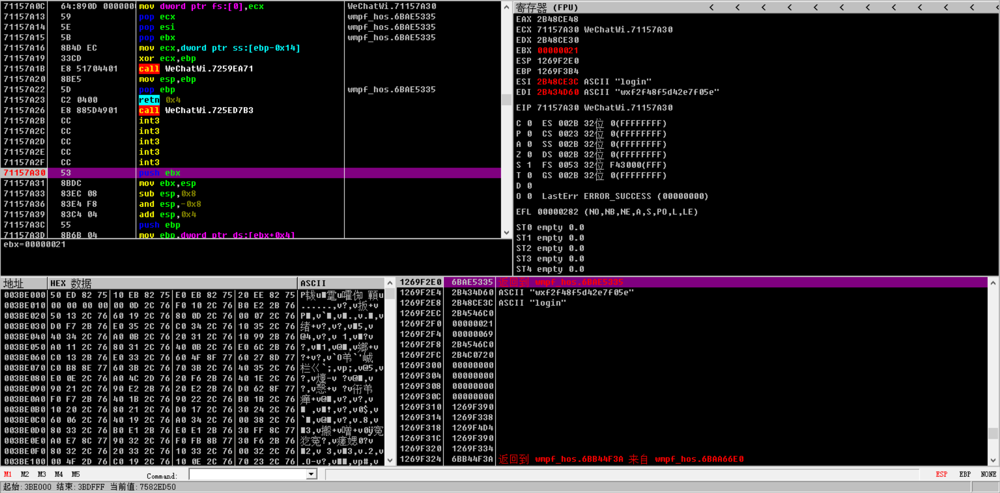
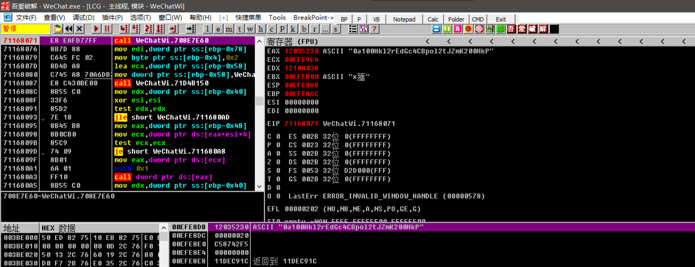

# 调用流程 

微信版本为3.9.2.23

## 1、请求call: WeChatWin.dll+0xFC7A30

应该是一个网络请求的api，调用时栈上压了五个请求参数

- 0x69:应该是一个网络请求id，具有自增性，可以是任意值
- 0x21:固定值
- 字符串指针:内容为 {"login_type":1,"version_type":1}
- 字符串指针:内容为 login
- 字符串指针:内容为 小程序的appid
  
## 2、获取返回的code: WeChatWin.dll+0xFD8071

在发送请求后，运行到这个地址，code的指针就放在栈顶和EAX里，这里也刚好有五个字节供hook